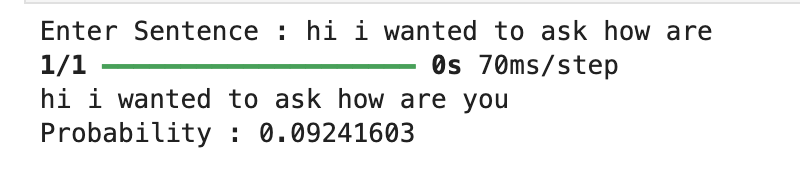
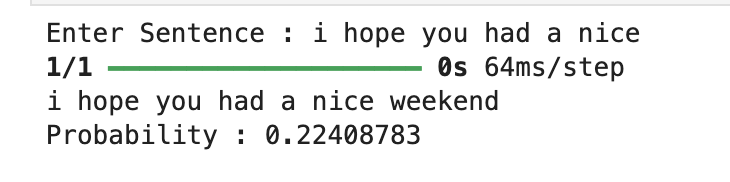

# Messaging Data Prediction using Deep Learning

## Overview

This project focuses on developing a deep learning model that predicts the next word a person is likely to type based on messaging data. The model utilizes a dataset sourced from [Mobile Text Archive](https://digitalcommons.mtu.edu/mobiletext/1/) and employs a Gated Recurrent Unit (GRU) layer for its predictive analysis.

## Workflow

1. **Data Collection**: Acquired messaging data from [Mobile Text Archive](https://digitalcommons.mtu.edu/mobiletext/1/).
  
2. **Data Cleaning**: Processed and cleaned the raw data to remove noise and ensure compatibility with the deep learning model.

3. **Data Tokenization**: Tokenized the cleaned data to prepare it for input into the GRU model.

4. **Model Architecture**: Implemented a GRU-based deep learning model in Python, leveraging TensorFlow.

5. **Model Training**: Explored different hyperparameters to optimize model performance, ultimately selecting the best set for accuracy.

6. **Model Evaluation**: Conducted predictions using the trained model to assess its effectiveness in predicting the next word in a sequence of text.

## Usage

To replicate the project, follow these steps:

1. **Setup**: Ensure Python environment is set up with dependencies from my 
   ```'
   NextWordPredictionClassifier.ipynb

2. **Model Training**: Train the GRU model using the preprocessed data.

3.. **Prediction**: Use the trained model to make predictions on new text data. `n` in the prediction function refers to how many predictions do you want of the sentence.

## Results

The GRU-based model demonstrated superior performance compared to LSTM on the specific dataset, achieving high accuracy in predicting the next word in messaging sequences.





## Future Improvements

- Explore ensemble techniques to further enhance prediction accuracy.
- Incorporate attention mechanisms to improve model understanding of long-range dependencies.
- Optimize tokenization and data preprocessing pipelines for efficiency.
